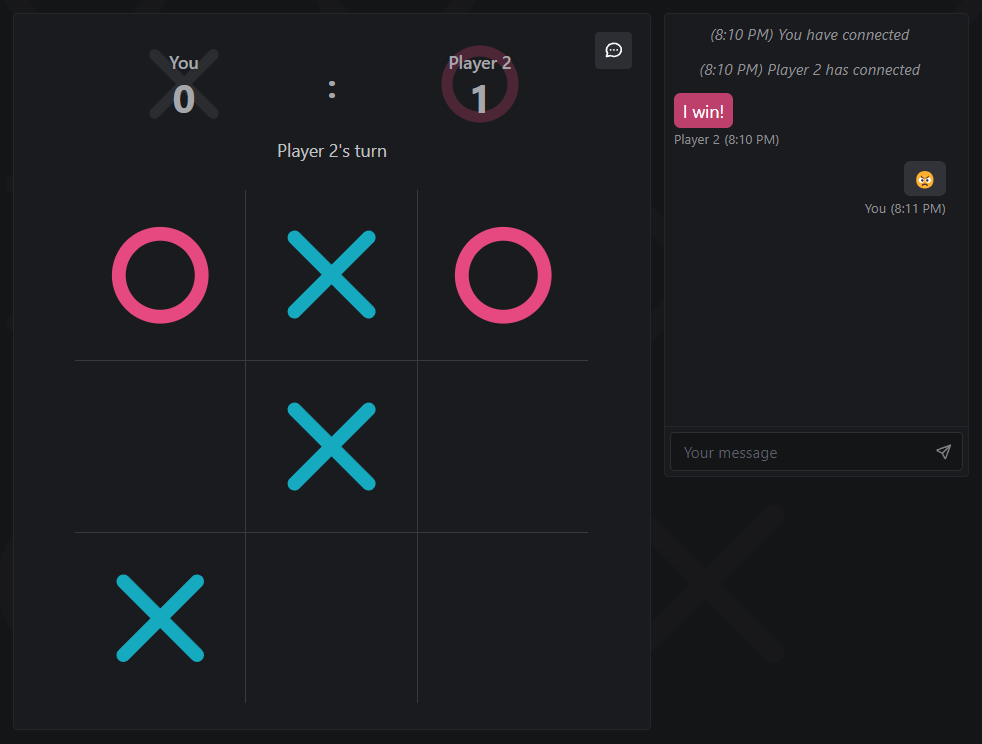

🕹️ Real-Time Multiplayer Tic-Tac-Toe
A browser-based multiplayer Tic-Tac-Toe game with built-in real-time chat—just share the game link with a friend and start playing instantly. Try it out here!

  

🔥 Key Features
Seamless real-time two-player Tic-Tac-Toe gameplay

Live chat integrated within the game interface

Scoreboard to track player victories across rounds

Fully responsive UI optimized for both desktop and mobile devices

🛠️ Tech Stack
Frontend: React, TypeScript, Tailwind CSS, Mantine (built with Vite)

Backend: Node.js, Express.js

Real-Time Communication: Socket.IO (WebSockets)
